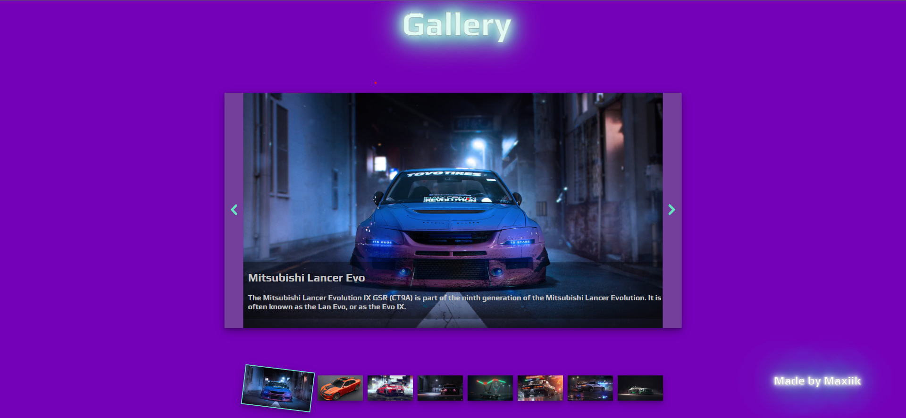
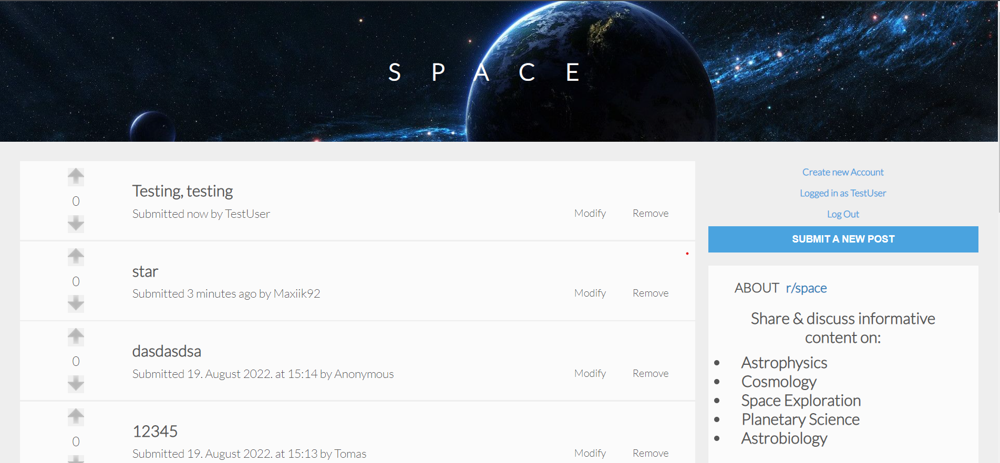
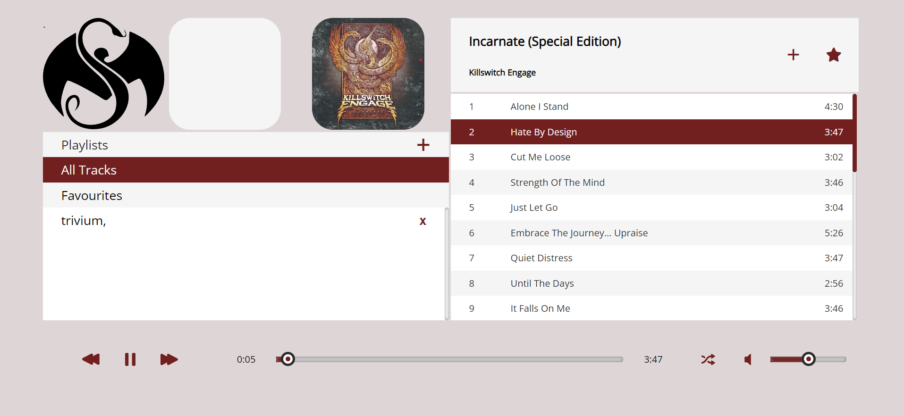
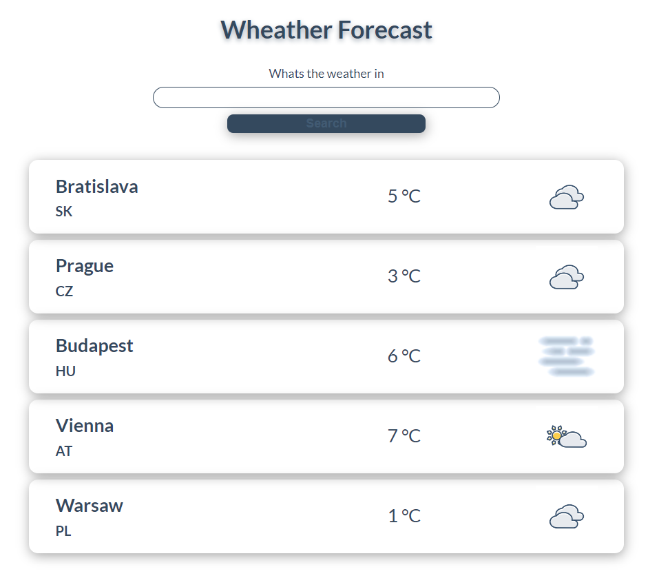
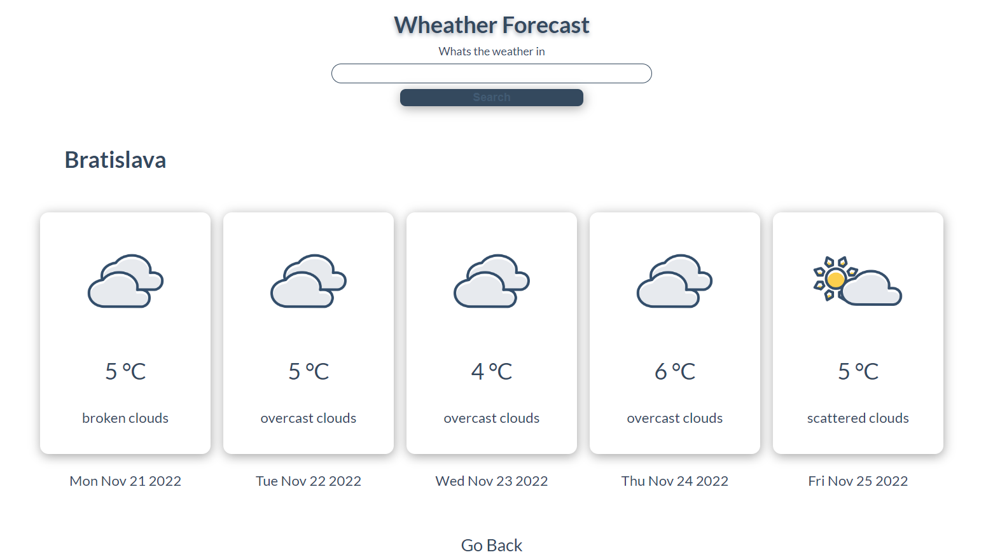

# What-i-have-created-in-Green-Fox-Academy

These are some projects that I was working on when I participated superintensive Fullstack developer course on Green Fox Academy

<b>Gallery project</b>
 
Week 06 - Day 05
 
DOM manipulation, JavaScript, CSS
Interactive gallery, hardcoded background color changer, on hover effects
 
https://github.com/Maxiik92/What-i-have-created-in-Green-Fox-Academy/tree/main/gallery-project

<b>Reddit-clone project</b>
 
Week 08 - Day 05
 
Express router, Dom manipulation, JavaScript, MySQL
First "login" attempt.
User can register, login, create posts, vote on posts that he did not created and modify or remove own created posts.
 
https://github.com/Maxiik92/What-i-have-created-in-Green-Fox-Academy/tree/main/reddit-clone-project

<b>Music player project</b>
 
Week 10
 
Last project of orientation phase, express router, Dom manipulation, MySQL,music metadata
App searches for mp3 files in given directory and automatically inserts paths to db so the player can find them.
User is able to create own playlists, mark track as favourite and than its stored in not deletable playlist "favourites".
User is able to repeat tracks, turn shuffle on, adjust volume, insert and delete songs from playlist
 
https://github.com/Maxiik92/What-i-have-created-in-Green-Fox-Academy/tree/main/music-player-project

<b>Weather App Angular project</b>
 
Week 11
 
One week long project, learning how Angular works, TypeScript, openweather.com 3rd party API
On landing page it shows 5 hardcoded cities with their current weather conditions.
After inserting valid city name in the input field the last city will be poped out, list will move and inserted city will be in first place.
If the city is already in the list then it will jump to the first place and the list will move as before.
On click on the "City tab" the view changes for 5 day forecast. There is also possible to insert city and show the values for forecast.
 
https://github.com/Maxiik92/What-i-have-created-in-Green-Fox-Academy/tree/main/weather-app

